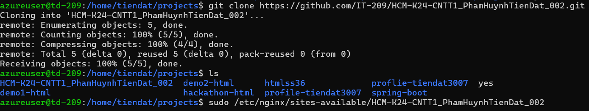
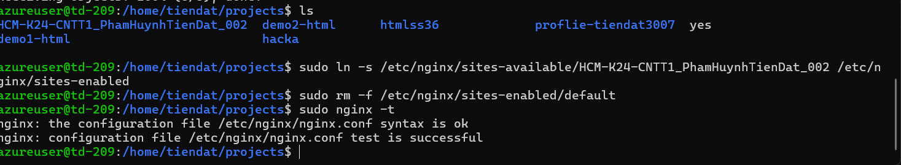
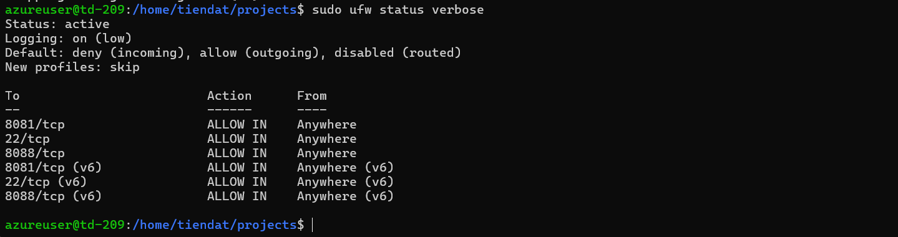
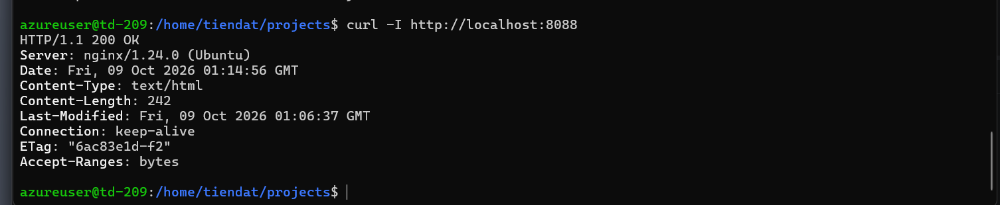
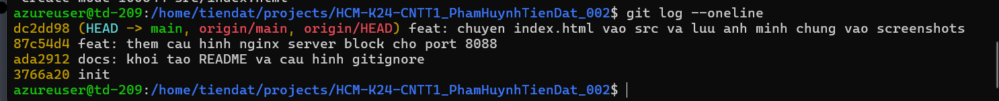
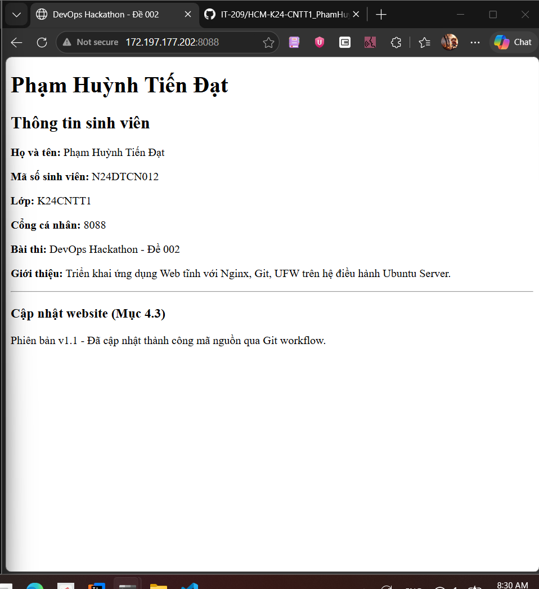

# Báo Cáo Thực Hành DevOps Hackathon - Đề 002

## 1. Thông Tin Sinh Viên
- **Họ và tên:** Phạm Huỳnh Tiến Đạt
- **Mã số sinh viên:** N24DTCN012
- **Lớp:** K24CNTT1
- **Cổng cá nhân được phân bổ:** 8088
- **Tài khoản Linux:** tiendat-k24cntt1
- **IP Máy chủ:** 172.197.177.202

## 3. Hình Ảnh Minh Chứng (screenshots/)

### 3.1 Minh chứng 01: id và whoami của tài khoản mới

### 3.2 Minh chứng 02: sudo nginx -t và systemctl status nginx

### 3.3 Minh chứng 03: sudo ufw status verbose

### 3.4 Minh chứng 04: Trình duyệt truy cập website

### 3.5 Minh chứng 05: git log --oneline

### 3.6 Minh chứng 06: Website sau khi cập nhật

---

## 4. Quy Trình Cập Nhật Ứng Dụng (Update Process)
1. **Tại máy cá nhân:** Chỉnh sửa tệp src/index.html để cập nhật nội dung mới.
2. **Commit và đẩy lên Git:**
   `ash
   git add src/index.html
   git commit -m  feat: cap nhat noi dung phien ban moi
   git push origin main
   `
3. **Tại máy chủ Ubuntu:** Kéo mã nguồn mới nhất về thư mục web:
   `ash
   cd /var/www/devops-hackathon-de002
   git pull origin main
   `
4. **Kiểm tra trên trình duyệt:** Tải lại trang web tại http://172.197.177.202:8088 để xác nhận nội dung thay đổi.
